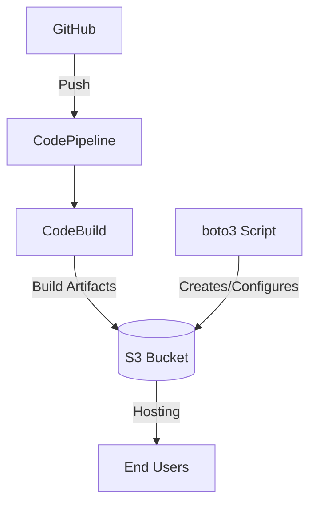

# AWS CI/CD Pipeline for Next.js + Tailwind CSS App


## 🚀 Deployment Workflow
1. Push code to the main branch on GitHub.
2. AWS CodePipeline automatically triggers on changes.
3. AWS CodeBuild executes the build process:
        Installs dependencies
        Builds the Next.js static export
4. The optimized output (out/ folder) is deployed to the S3 bucket.
5. S3 hosts the app as a high-performance static website.

## 🛠️ Architecture Overview


## 📌 1. Prerequisites
- AWS account with:
  - CodePipeline permissions
  - CodeBuild permissions
  - S3 full access
- Node.js ≥ 18.x
- Python 3.x (for Boto3 scripts)
- Configured AWS CLI

## 🚨 2. Features
- **Boto3 Automation**: Programmatic S3 bucket creation and configuration
- **CI/CD Pipeline**: Zero-touch deployments on Git push
- **Static Export**: Next.js optimized for S3 hosting
- **Tailwind CSS**: Production-optimized styles
- **Full Automation**: From code push to live deployment

## 🛠️ 3. Steps

### **App creation and set up**
A Next.js application simulating a cloud services provider's dashboard created with AI assistance using [v0.dev] 
You are free to use the same app that I used for this project, or you can build your own.
You can check the application and its source code at: [https://github.com/leobezuti/app-projects]

```bash
# Clone the project
git clone https://github.com/leobezuti/app-projects.git
cd app-projects

# Install dependencies
npm install
```

### **Create S3 Bucket for static hosting**
You can use the AWS console to create the bucket, but I built a python script with Boto3 to automate the process (bucket.py).
The bucket.py script automates buckets setup with these key features:
1. Bucket Initialization
2. Public Access Configuration
3. Static Website Hosting
4. Security Policy
5. Error Handling

```python
import boto3
import json
from botocore.exceptions import ClientError

def create_bucket(region='sa-east-1'):
    bucket_name = 'cloud-app-project-1'
    s3 = boto3.client('s3', region_name=region)

    try:
        print(f'Criando o bucket {bucket_name}')
        
        if region != 'us-east-1':
            s3.create_bucket(
                Bucket=bucket_name,
                CreateBucketConfiguration={'LocationConstraint': region}
            )
        else:
            s3.create_bucket(Bucket=bucket_name)

        s3.put_public_access_block(
            Bucket=bucket_name,
            PublicAccessBlockConfiguration={
                'BlockPublicAcls': False,
                'IgnorePublicAcls': False,
                'BlockPublicPolicy': False,
                'RestrictPublicBuckets': False
            }
        )

        s3.put_bucket_website(
            Bucket=bucket_name,
            WebsiteConfiguration={
                'ErrorDocument': {'Key': 'error.html'},
                'IndexDocument': {'Suffix': 'index.html'},
            }
        )

        bucket_policy = {
            "Version": "2012-10-17",
            "Statement": [
                {
                    "Sid": "PublicReadGetObject",
                    "Effect": "Allow",
                    "Principal": "*",
                    "Action": "s3:GetObject",
                    "Resource": f"arn:aws:s3:::{bucket_name}/*"
                }
            ]
        }

        s3.put_bucket_policy(
            Bucket=bucket_name,
            Policy=json.dumps(bucket_policy)
        )

        print(f'Bucket configurado com sucesso!')
        print(f'URL: http://{bucket_name}.s3-website-{region}.amazonaws.com')

    except ClientError as e:
        print(f'Erro: {e}')

if __name__ == '__main__':
    create_bucket()
```

### **Create pipeline on CodePipeline**
- Go to CodePipeline, name your pipeline and choose "new service role"
- In source provider (source stage) select GitHub and connect your account
- Select the repository and branch 
- Now in the build stage, select the provider "AWS CodeBuild" and choose create project

### **Build the project with CodeBuild**
- Go to CodeBuild and name your project
- Choose the type (Default project for me)
- Choose the image and "use a buildspec file"
- Now you need to create the buildspec.yml file, this file automates Next.js installation, build, and packaging for S3 deployment via AWS CodeBuild

```yaml
version: 0.2

phases:
  install:
    commands:
      - npm install --legacy-peer-deps

  build:
    commands:
      - npm run build
      - mkdir -p dist
      - cp -r out/* dist/
      - cp -r public/* dist/

artifacts:
  base-directory: dist
  files: '**/*'
```

- Keep the rest as default and choose to continue to CodePipeline

### **Finish the Pipeline setup**
- Go to deploy stage
- Select the provider "Amazon S3"
- Select the bucket created before
- Select "Extract file before deploy" 
- Review the configuration and create the pipeline

### **Test the pipeline**
- In every change that you make to the code and push to GitHub the pipeline is trigged and if everything is correct, the stages are completed.
- I made a change in the price of the profissional plan, the price was 99 dollars and I reduced to 80. Immediately the CodePipeline worked and the price was changed.

### Original Price


### Pipeline hadling the change


### New Price


## 🎯 4. Conclusion

This project demonstrates a **complete automated CI/CD solution** for Next.js + Tailwind CSS applications on AWS, integrating:

1. **Infrastructure as Code**  
   - Automated S3 bucket creation via Boto3  
   - Static website hosting configuration and access policies  

2. **End-to-End Pipeline**  
   - GitHub → CodePipeline → CodeBuild → S3 deployment  
   - Zero-touch deployments on git push  

3. **Optimized Hosting**  
   - Next.js static export for S3 compatibility  
   - Tailwind CSS production-ready styles  

4. **Full Automation**  
   - From code commit to live deployment in minutes  
   - Infrastructure and deployment managed through config files  

### Key Benefits:
✔ **Cost-effective** static hosting  
✔ **Developer-friendly** workflow  
✔ **Production-ready** architecture  
✔ **Extensible** for additional AWS services  
